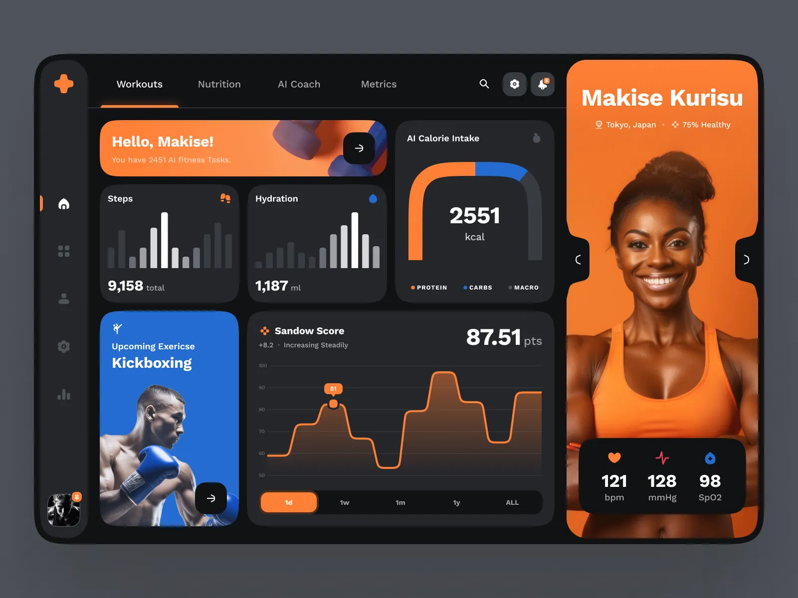

#  FitDash - Your Personal Fitness Dashboard

[](https://reactjs.org/)
[](https://www.typescriptlang.org/)
[](https://tailwindcss.com/)
[](https://vitejs.dev/)
[](LICENSE)

## 🚀 Overview

FitDash is a modern fitness tracking platform designed to help you monitor your health metrics, workouts, nutrition, and progress in one beautiful dashboard. Built with React, TypeScript, and Tailwind CSS, FitDash brings an intuitive and responsive experience to help you achieve your fitness goals.

<p align="center">
  
</p>

## ✨ Features

- **📊 Comprehensive Metrics** - Track calories, steps, weight, and more in real-time
- **💪 Workout Tracking** - Log your exercises, sets, reps, and monitor your progress
- **🥗 Nutrition Management** - Track your meals, macros, and dietary habits
- **🧠 AI Coach** - Get personalized workout and nutrition advice
- **💤 Sleep Monitoring** - Track your sleep patterns and quality
- **🏆 Goal Setting** - Set and track your fitness goals with visual progress indicators
- **📱 Responsive Design** - Perfect experience on both desktop and mobile devices

## 🛠️ Technology Stack

- **Frontend**: React, TypeScript, Tailwind CSS
- **UI Components**: Shadcn UI with custom components
- **State Management**: React Context API
- **Animations**: Framer Motion
- **Icons**: Lucide React
- **Build Tool**: Vite
- **Package Manager**: Bun

## 🏃‍♂️ Getting Started

### Prerequisites

- Node.js (v18+)
- Bun (recommended) or npm/yarn

### Installation

1. Clone the repository:

```bash
git clone https://github.com/yourusername/fitdash.git
cd fitdash
```

2. Install dependencies:

```bash
bun install
# OR
npm install
```

3. Start the development server:

```bash
bun dev
# OR
npm run dev
```

4. Open your browser and navigate to `http://localhost:5173`

## 📱 Application Structure

```
src/
├── components/     # Reusable UI components
│   ├── ui/         # Shadcn UI components
│   └── ...         # Custom components (Cards, Navigation, etc.)
├── hooks/          # Custom React hooks
├── lib/            # Utility functions and helpers
├── pages/          # Application pages
└── ...
```

## 🎨 Key Components

- **Dashboard**: The main interface showing your fitness metrics at a glance
- **Workout Tracker**: Log and monitor your exercise routines
- **Nutrition Planner**: Track your meals and nutrition intake
- **AI Coach**: Get personalized advice based on your goals and progress
- **Profile**: Manage your personal information and preferences

## 📦 Available Scripts

- `bun dev` - Start the development server
- `bun build` - Build the app for production
- `bun preview` - Preview the production build locally
- `bun test` - Run tests (when implemented)
- `bun lint` - Run ESLint to check for code quality issues

## 📷 Screenshots

<table>
  <tr>
    <td></td>
    <td></td>
  </tr>
  <tr>
    <td><em>Main Dashboard</em></td>
    <td><em>Fitness Metrics</em></td>
  </tr>
</table>

## 🤝 Contributing

Contributions are welcome! Please feel free to submit a Pull Request.

1. Fork the repository
2. Create your feature branch (`git checkout -b feature/amazing-feature`)
3. Commit your changes (`git commit -m 'Add some amazing feature'`)
4. Push to the branch (`git push origin feature/amazing-feature`)
5. Open a Pull Request

## 📝 License

This project is licensed under the MIT License - see the [LICENSE](LICENSE) file for details.

## 🙏 Acknowledgements

- [React](https://reactjs.org/)
- [TypeScript](https://www.typescriptlang.org/)
- [Tailwind CSS](https://tailwindcss.com/)
- [Shadcn UI](https://ui.shadcn.com/)
- [Framer Motion](https://www.framer.com/motion/)
- [Lucide React](https://lucide.dev/)
- [Vite](https://vitejs.dev/)

---

<p align="center">
  Made with ❤️ by the FitDash Team
</p>
